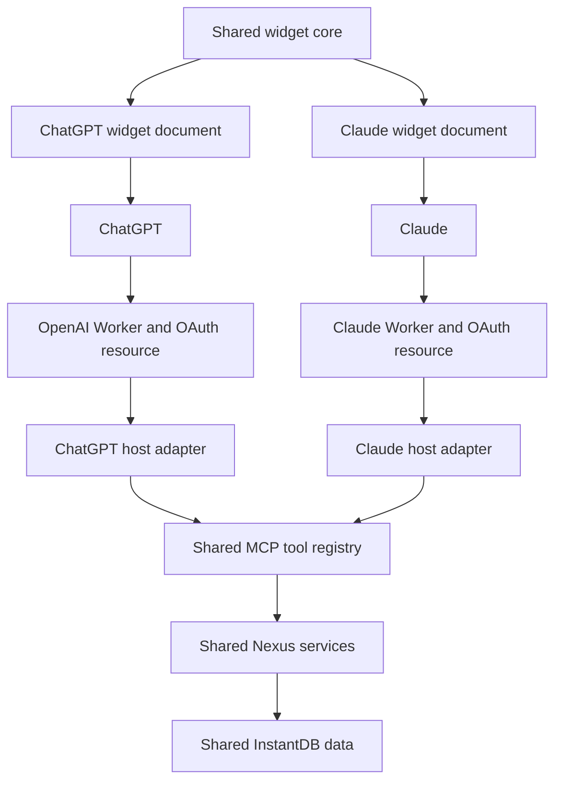

# Nexus cross-host architecture

**Status:** Target architecture and implementation plan  
**Date:** 2026-07-14  
**Scope:** Nexus on ChatGPT and Claude

## Decision

Nexus will be one product with one shared backend and two host-specific presentations.

We will **not** maintain two copies of Nexus. Tool behavior, schemas, validation, authentication logic, database access, and business rules remain shared. We will also **not** ship a universal widget that detects its host at runtime or falls through multiple protocol implementations.

Instead, the build produces two isolated applications:

| Surface | ChatGPT | Claude |
|---|---|---|
| MCP endpoint | `https://mcp.nexus.kushalsm.com/mcp` | `https://claude-mcp.nexus.kushalsm.com/mcp` |
| Worker | `nexus-mcp` | `nexus-mcp-claude` |
| MCP tools and handlers | Shared | Shared |
| Database and user records | Shared | Shared |
| OAuth implementation | Shared | Shared |
| OAuth resource identity and callbacks | ChatGPT-specific | Claude-specific |
| Widget application model and components | Shared | Shared |
| Widget document, bridge, theme, and sizing | ChatGPT-specific | Claude-specific |
| Widget cache URI | Versioned independently | Versioned independently |
| Deployment and rollback | Independent | Independent |

The architectural boundary is therefore:

> Share product behavior. Separate host behavior.

This is operational isolation, not backward compatibility. Each production artifact contains exactly one current host implementation.

## Why this boundary is correct

The strongest argument against separation is that ChatGPT and Claude both implement MCP Apps, so one HTML document ought to work everywhere. That is true at the protocol-contract level but false at the product-runtime level.

The hosts currently differ in behavior that materially affects the widget:

- sandbox-domain requirements;
- OAuth protected-resource identity and callback registration;
- iframe lifecycle and initialization timing;
- available container dimensions and outer chrome;
- theme variables and surrounding visual treatment;
- height negotiation and resize behavior;
- delivery of live updates after a mutation;
- caching and connector refresh behavior.

Trying to hide those differences inside one document creates conditional boot code, silent compatibility paths, and tests that cannot prove which implementation is actually running. Forking the entire application is worse: schemas and business behavior would drift.

The useful split is in the middle. The domain and UI model remain shared; the host boundary is explicit and compiled separately.

**Confidence: high.** We have already proven that the same Nexus operations and data can work through both endpoints, while the two hosts require different iframe behavior.

## Architecture



There are four layers:

1. **Shared product core** — schemas, validation, services, data access, and authentication implementation.
2. **Shared MCP contract** — the same tool names, descriptions, inputs, outputs, annotations, and handlers.
3. **Shared widget core** — state model, formatting, components, interactions, and semantic style tokens.
4. **Host adapters** — endpoint configuration, OAuth identity, resource metadata, bridge lifecycle, document shell, theme mapping, sizing, and host-specific update transport.

## What remains shared

### Tool contract

Both endpoints expose the same five tools:

1. `nexus_log_entries`
2. `nexus_get_history`
3. `nexus_update_entry`
4. `nexus_manage_friends`
5. `nexus_set_goal`

For each tool, these fields must remain identical between hosts:

- name and title;
- description;
- input schema;
- output schema;
- behavioral annotations;
- validation;
- handler;
- business result;
- user-facing text result;
- `structuredContent` shape.

Only the widget resource reference may differ, because each host has its own immutable document URI.

The host must never appear in a tool handler as a behavioral condition. Code such as `if (target === "claude")` inside logging, history, friend, goal, or update logic is an architectural violation.

### CRUD and data pipeline

Both endpoints use the same path:

```text
tool input
  -> shared schema validation
  -> shared Nexus service
  -> shared InstantDB application
  -> shared result builder
  -> host-specific transport and widget resource
```

This guarantees that logging a meal through Claude and reading history through ChatGPT operates on the same user data. We are not creating a Claude database, a Claude user model, or Claude-specific CRUD functions.

### Authentication implementation

The following remain shared:

- consent-page implementation;
- email/password sign-in;
- account creation;
- Google sign-in logic;
- user lookup and creation;
- authorization-code handling;
- token issuance and validation code.

The following are host configuration and therefore separate:

- public base URL;
- protected-resource URL;
- token audience;
- authorization callback target;
- Google OAuth redirect URI;
- Durable Object/session namespace;
- host label shown during consent.

The same person signing into both endpoints must resolve to the same Nexus user record. Tokens and sessions remain scoped to the endpoint that issued them.

### Widget product model

The core widget should own:

- normalization of `structuredContent`;
- calorie, protein, carbohydrate, and fat calculations;
- date and number formatting;
- view state such as calorie/macro mode;
- entry-list rendering;
- shared component markup;
- edit intent and form validation;
- semantic layout primitives;
- accessibility labels;
- deterministic application of mutation results.

The core must not know about `window.openai`, Claude, iframe origins, MCP message envelopes, or host-specific CSS variables.

## What remains separate

### Deployments and resource identities

The endpoints remain separate even though they use the same source code:

```text
ChatGPT: mcp.nexus.kushalsm.com
Claude:  claude-mcp.nexus.kushalsm.com
```

Each deployment has its own:

- Worker name;
- custom hostname;
- `BASE_URL`;
- OAuth protected-resource identity;
- Durable Object binding;
- widget URI and cache version;
- widget domain metadata;
- secrets and deployment history;
- rollback target.

Deploying Claude must not modify the ChatGPT Worker. Deploying ChatGPT must not modify the Claude Worker.

### Widget documents

ChatGPT and Claude receive different final HTML documents. These are not one document with runtime detection.

The ChatGPT document contains only:

- the ChatGPT bridge and lifecycle;
- the ChatGPT resource metadata;
- the ChatGPT theme mapping;
- the ChatGPT sizing policy;
- the ChatGPT live-update adapter;
- the shared widget core.

The Claude document contains only:

- the Claude bridge and lifecycle;
- the Claude resource metadata;
- the Claude theme mapping;
- the Claude sizing policy;
- the Claude mutation/update adapter;
- the shared widget core.

There is no `if (window.openai)` branch, host sniffing, bridge timeout followed by another bridge, or legacy metadata alongside current metadata.

### Bridge lifecycle

Both bridges implement the current MCP Apps contract, but each is responsible for the host behavior we have actually observed.

The bridge adapter exposes a small internal interface to the widget core:

```ts
interface NexusHostBridge {
  start(): Promise<void>;
  onToolResult(handler: (result: NexusWidgetResult) => void): () => void;
  callTool(name: string, args: unknown): Promise<NexusWidgetResult>;
  reportSize(size: { width: number; height: number }): void;
  getContext(): NexusHostContext;
}
```

That interface is ours; its implementations are host-specific. The UI core should not construct or inspect raw JSON-RPC messages.

### Theme

The shared components use semantic Nexus tokens:

```css
--nx-background
--nx-surface
--nx-surface-subtle
--nx-text
--nx-text-muted
--nx-border
--nx-accent
--nx-progress-track
```

Each host maps those tokens independently. This permits a warmer or darker Claude card and a ChatGPT-native card without duplicating component CSS or calculations.

Host theme files may change color, shadow, border, density, and type treatment. They may not change data semantics or tool behavior.

### Sizing and outer container

Nexus controls the content inside the iframe. It does not control the host's header, tool label, outer border, maximum viewport, composer overlap, or fullscreen affordance.

The host adapter controls what Nexus can influence:

- the widget root's intrinsic height;
- compact versus expanded internal layout;
- reporting size changes to the host;
- responding to host-provided container dimensions;
- requesting a supported display mode;
- limiting visible entries in an inline card.

Size measurement must use the actual Nexus content root, not `document.documentElement` or the viewport. Measuring the viewport and reporting it back can create a feedback loop in which the host expands the iframe, the document reports the new iframe height, and the frame grows again.

The target behavior is:

- **inline mode:** bounded card, compact totals, a limited entry list, no empty vertical canvas;
- **expanded/fullscreen mode:** use the available height and expose the complete history or editing surface;
- **mobile:** reflow components without assuming desktop card width;
- **every mode:** report a new size only when the root dimensions materially change.

ChatGPT and Claude may choose different inline maximum heights because their outer containers are different.

### Live state

`structuredContent` is the authoritative first-paint snapshot on both hosts. A widget must render correctly without waiting for a database subscription.

After first paint:

- ChatGPT may use the current InstantDB subscription adapter for live updates.
- Claude may apply the result returned by widget-initiated MCP tool calls directly, without loading the InstantDB browser runtime.

Both paths feed the same shared reducer. Neither host adapter may repaint with stale boot data after a newer state version has been applied.

The recommended result envelope is:

```ts
interface NexusWidgetResult {
  stateVersion: number | string;
  lastMutationId?: string;
  day: NexusDaySnapshot;
}
```

`stateVersion` is not required for the first extraction step, but it is the clean way to reject late or duplicated snapshots once cross-host editing becomes more complex.

## Target source structure

The exact filenames can change during extraction, but ownership should look like this:

```text
workers/src/
  mcp.ts                         # Worker entry and shared agent wiring
  mcp/
    host-config.ts               # Compile-time target configuration
    register-resource.ts         # Resource registration using host config
    register-tools.ts            # One shared tool registry
    result-builders.ts           # Shared text and structuredContent

  schema/                        # Existing shared input/output schemas
  data/                          # Existing shared InstantDB/data functions
  auth/                          # Shared OAuth implementation
  handlers/                      # Existing shared HTTP/auth handlers

  widget/
    core/
      model.ts                   # Snapshot normalization and types
      reducer.ts                 # Snapshot and mutation application
      render.ts                  # Shared components and markup
      interactions.ts            # Shared toggles and edit intents
      styles.css                 # Shared structural/component styles
      assets.ts                  # Shared statue/art assets

    openai/
      bridge.ts                  # ChatGPT lifecycle and tool calls
      live-state.ts              # InstantDB subscription adapter
      sizing.ts                  # ChatGPT root measurement policy
      theme.css                  # ChatGPT token mapping
      document.ts                # Produces ChatGPT HTML only

    claude/
      bridge.ts                  # Claude lifecycle and tool calls
      mutation-state.ts          # Applies returned mutation snapshots
      sizing.ts                  # Claude root measurement policy
      theme.css                  # Claude token mapping
      document.ts                # Produces Claude HTML only

workers/scripts/
  build-widget.mjs               # Explicit target -> final artifact

workers/widget-build/
  openai/nexus-today.html        # Generated, host-pure artifact
  claude/nexus-today.html        # Generated, host-pure artifact
```

The existing `today-html.ts` can be extracted incrementally. There is no value in rewriting the visual component tree simply to achieve this boundary.

## Build contract

The build target is explicit:

```bash
npm run build:widget:openai
npm run build:widget:claude
```

Each command must produce a deterministic HTML artifact. The build fails if:

- the target is missing or unknown;
- the target's bridge is missing;
- both host bridges appear in one artifact;
- forbidden host globals or metadata appear in the wrong artifact;
- a placeholder remains unresolved;
- the HTML exceeds an intentional size budget;
- the widget URI is not configured for that target.

Do not inject JavaScript using an unsafe replacement-string call where `$&`, `$'`, or `$\`` sequences can be interpreted by `String.prototype.replace`. Use a replacement function or a real template/build step.

Host selection happens at build time, never at runtime.

## Metadata contract

Shared resource metadata is generated from a typed host configuration. Fields that differ are supplied by the host adapter rather than scattered through tool registration.

Conceptually:

```ts
interface NexusHostConfig {
  target: "openai" | "claude";
  publicBaseUrl: string;
  mcpResourceUrl: string;
  widgetResourceUri: string;
  widgetDomain: string;
  buildWidgetDocument(): string;
}
```

The OpenAI build follows OpenAI's current Apps SDK requirements. The Claude build follows Claude's current connector and MCP Apps requirements. A field supported by only one host lives in that host's metadata builder; it does not justify contaminating the other artifact.

Current, host-specific extensions are allowed when they implement a deliberate feature. They are not fallbacks. Deprecated keys and duplicate old/new representations are prohibited.

## Testing strategy

### 1. Shared contract parity

Start both Workers locally, call MCP `initialize`, then compare `tools/list` results.

After normalizing the host-specific widget resource URI, the five tool definitions must be deeply equal. This test compares serialized production output, not source constants.

### 2. Shared behavior parity

Run the same authenticated fixtures against each endpoint:

- log a zero-calorie entry;
- log a normal meal;
- read history;
- update an entry;
- set a goal;
- manage a friend relationship.

Assert identical database effects and equivalent structured results. Clean up test entries explicitly.

### 3. Artifact purity

Inspect the generated HTML:

- OpenAI artifact contains only the OpenAI bridge;
- Claude artifact contains only the Claude bridge;
- neither contains runtime host detection;
- neither contains unresolved placeholders;
- neither contains deprecated protocol paths;
- each contains the correct immutable resource URI and domain metadata.

### 4. Lifecycle contract tests

Use separate mock hosts derived from captured, observed host messages. Do not use one permissive mock that accepts both implementations.

For each host, verify:

- initialization completes;
- the initial tool result paints;
- a late tool result updates state;
- duplicate notifications are idempotent;
- a tool-call result repaints the card;
- a failed initialization becomes visible rather than hanging forever;
- size changes are reported without a feedback loop.

### 5. Visual and sizing tests

Capture both host documents at:

- narrow mobile width;
- normal inline desktop width;
- host-provided constrained height;
- expanded/fullscreen dimensions;
- light and dark themes where supported;
- zero, one, and many entries.

The Claude test must specifically reject the large empty vertical canvas seen in the current desktop screenshot.

### 6. OAuth smoke tests

For both public endpoints, verify independently:

- protected-resource discovery;
- dynamic client registration where applicable;
- email/password sign-in;
- Google sign-in redirect acceptance;
- callback completion;
- token exchange;
- authenticated MCP `initialize`;
- authenticated `tools/list` and a harmless tool call.

An OAuth success against one endpoint is not evidence for the other because the resource and audience differ.

### 7. Real-host canaries

Mocks prove our contract; they do not prove the hosts. Before declaring either deployment healthy, run a direct single-tool logging call in the real host and verify:

- tool execution succeeds;
- widget data paints;
- the toggle works;
- editing updates the visible card;
- compact sizing is correct;
- reconnecting the connector still loads the current widget URI.

ChatGPT web, ChatGPT iOS, Claude web, and Claude iOS are separate canary rows. A pass on one is not a pass on another.

## Deployment and cache policy

Widget resource URIs are immutable cache identities. A behavioral HTML change requires a new URI for the affected host.

Examples:

```text
ui://widget/nexus-today-openai-v14.html
ui://widget/nexus-today-claude-v4.html
```

The versions do not need to remain numerically aligned. A Claude-only CSS or sizing fix increments only the Claude URI and deploys only the Claude Worker.

Deployment commands must make the target obvious:

```bash
npm run deploy:openai
npm run deploy:claude
```

Each command runs its target's build and tests before deploying. The scripts should refuse ambiguous default configuration rather than infer the target from environment state.

Rollback is also independent: restore the previous Worker deployment and resource URI for the failing host without touching the other host.

## Migration plan

### Phase 0 — Freeze current behavior

1. Record the current tool definitions from both production endpoints.
2. Save representative `structuredContent` fixtures.
3. Capture current ChatGPT and Claude widget screenshots at mobile and desktop sizes.
4. Record current OAuth smoke-test commands and results.

### Phase 1 — Extract the shared widget core

1. Move normalization, state, rendering, and interactions out of `today-html.ts`.
2. Keep current HTML and CSS behavior unchanged.
3. Add pure unit tests for snapshot application, toggle state, formatting, and edit results.

### Phase 2 — Produce two real documents

1. Add `widget/openai/document.ts`.
2. Add `widget/claude/document.ts`.
3. Move each bridge into its corresponding host directory.
4. Delete bridge placeholder replacement from the monolithic document.
5. Add artifact-purity assertions.

### Phase 3 — Separate presentation policy

1. Extract shared structural CSS.
2. Add host token mappings.
3. Implement root-based sizing independently.
4. Make Claude inline mode compact without changing ChatGPT visuals.

### Phase 4 — Prove mutation state

1. Route both host mutation results through the shared reducer.
2. Verify Claude edit and toggle behavior in a real conversation.
3. Verify InstantDB updates cannot be overwritten by stale ChatGPT boot data.
4. Add `stateVersion` only if ordering remains ambiguous.

### Phase 5 — Deploy independently

1. Deploy Claude first because its sizing is the immediate host-specific problem.
2. Run Claude web and iOS canaries.
3. Deploy ChatGPT only if its artifact changed.
4. Run ChatGPT web and iOS canaries.
5. Preserve the previous resource URI for immediate rollback.

### Phase 6 — Remove the old construction path

Delete the monolithic HTML generator, unused bridge vendors, stale protocol tests, and any target conditionals that remain outside host configuration. Do this only after both production artifacts pass canaries.

## Rules that prevent architectural drift

1. A tool-contract change is implemented once and tested against both endpoints.
2. A business-rule change never branches on host.
3. A host visual or lifecycle change stays inside that host directory.
4. A generated artifact contains one bridge and one metadata dialect.
5. A host-only deploy never changes the other host's Worker, URI, or OAuth resource.
6. `structuredContent` must always be sufficient for first paint.
7. Browser subscriptions enhance freshness; they are not required to render.
8. Host failures must become diagnosable state, not an eternal skeleton.
9. Production evidence is recorded per host and per client surface.
10. No fallback is added merely because behavior is uncertain; uncertainty is resolved with a test or an isolated host implementation.

## Non-goals

This architecture does not:

- change the five Nexus tool mechanics;
- create separate Claude and ChatGPT user accounts;
- create separate databases;
- solve ChatGPT iOS's multi-tool widget bug inside Nexus;
- force identical visual dimensions across different host containers;
- guarantee that every MCP Apps host can consume either production endpoint;
- preserve deprecated SDK or metadata paths;
- require a rewrite of the current Nexus design.

## Definition of done

The restructuring is complete when:

- one shared tool registry produces equivalent tool contracts on both endpoints;
- all five tools exercise the same services and database;
- both OAuth resources authenticate independently into the same Nexus identity system;
- ChatGPT and Claude receive different, host-pure HTML artifacts;
- shared UI behavior is imported rather than copied;
- Claude sizing and colors can change without changing ChatGPT output;
- ChatGPT presentation can change without changing Claude output;
- both mutation paths update the shared widget state deterministically;
- artifact, contract, OAuth, sizing, and CRUD tests pass;
- real ChatGPT and Claude canaries pass on web and mobile;
- deploying or rolling back one host cannot disrupt the other.

## Source references

- [OpenAI Apps SDK: Build your MCP server](https://developers.openai.com/apps-sdk/build/mcp-server)
- [Claude connectors: MCP Apps cross-compatibility](https://claude.com/docs/connectors/building/mcp-apps/cross-compatibility)
- [MCP Apps specification, 2026-01-26](https://github.com/modelcontextprotocol/ext-apps/blob/main/specification/2026-01-26/apps.mdx)

