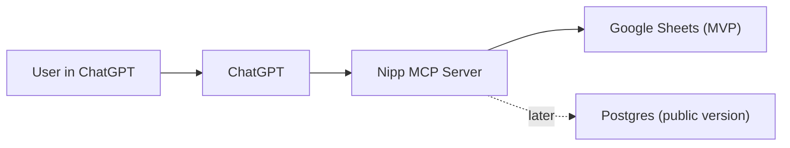

# Nipp: ChatGPT-First Logging App

## Goal

Make `ChatGPT` the interface for a calorie/workout logging app with no standalone frontend.

`Nipp` should:
- accept structured write/read requests from ChatGPT
- store logs reliably
- start with one personal Google Sheet
- later support real user accounts and global multi-user usage

The first version is intentionally small: no app UI, no separate mobile app, no user auth, and no heavy analytics.

## Core Decision

Build `Nipp` as a **remote MCP server**, not as a CLI that ChatGPT "installs".

Why:
- ChatGPT apps/connectors talk to remote servers over HTTPS.
- ChatGPT does not persistently install a local CLI from a shared doc link.
- A CLI can still exist, but it should call the same backend/service layer as the MCP tools.

Practical rule:
- `MCP` is the integration surface for ChatGPT.
- `CLI` 

## Product Shape

### What ChatGPT is responsible for

- natural language understanding
- turning user intent into tool calls
- asking follow-up questions when data is missing

### What Nipp is responsible for

- strict validation
- deterministic writes
- read/update/delete behavior
- idempotency
- storage
- auditability

Nipp should not call an LLM internally for the MVP.

## Constraints

- The first version is **text-first**. Do not assume ChatGPT voice mode will work with apps/connectors.
- MVP is **single-user** and **internal**.
- Google Sheets is acceptable for MVP, but it should not remain the primary database once the product goes public.

## Recommended Stack

### MVP

- Language: `Python 3.12`
- API framework: `FastAPI`
- MCP layer: `FastMCP` or equivalent Python MCP server library
- Storage: `Google Sheets`
- Hosting: `Google Cloud Run`
- Secrets: `Google Secret Manager`
- Observability: structured logs to `Cloud Logging`

### Public version

- Keep `FastAPI` + MCP server
- Add `Postgres` as source of truth
- Keep `Google Sheets` only as export/backoffice sink
- Add OAuth-based user auth for ChatGPT app connection

## Why Cloud Run

Use `Cloud Run` unless there is a strong reason not to.

Reasons:
- simple HTTPS service deployment
- container-based
- cheap and low-ops for an MVP
- easy secret management
- easy connection to GCP services
- enough for a small write-heavy tool backend

Do not start on Kubernetes for this. It is unnecessary overhead for Nipp v0.

## High-Level Architecture

## MVP Scope

### User flow

1. You deploy `Nipp` as a remote MCP server.
2. You connect it to ChatGPT in developer mode as your personal connector.
3. You talk to ChatGPT normally.
4. ChatGPT calls Nipp tools.
5. Nipp appends or reads rows from your Google Sheet.

### MVP tools

Keep the tool set very small.

- `log_food_entry`
- `log_workout_entry`
- `list_recent_entries`
- `update_entry`
- `delete_entry`

If you want to cut scope further, drop `update_entry` and `delete_entry` for week one and only support append + list.

## Data Model

Do not let ChatGPT write arbitrary row blobs. Define a strict schema.

### Option A: one unified sheet tab

Sheet name: `entries`

Columns:
- `entry_id`
- `entry_type`
- `created_at`
- `event_at`
- `source`
- `request_id`
- `text`
- `calories`
- `protein_g`
- `carbs_g`
- `fat_g`
- `exercise`
- `sets`
- `reps`
- `weight`
- `duration_min`
- `notes`
- `deleted_at`

### Recommendation

Use **one unified tab** for MVP.

Why:
- fewer moving parts
- simpler CRUD
- easier to migrate to Postgres later
- easier to debug

## Tool Contract

Every write tool should accept structured inputs, not free-form text only.

Example:

- `log_food_entry(event_at, text, calories, protein_g?, carbs_g?, fat_g?, request_id?)`
- `log_workout_entry(event_at, exercise, sets?, reps?, weight?, duration_min?, notes?, request_id?)`
- `update_entry(entry_id, patch)`
- `delete_entry(entry_id)`
- `list_recent_entries(limit, entry_type?)`

### Important

Add `request_id` for idempotency.

Reason:
- ChatGPT can retry tool calls
- network timeouts can happen
- you do not want duplicate rows in the sheet

If `request_id` already exists, return the prior result instead of writing again.

## Google Sheets Design

### MVP setup

- create one Google Sheet
- create one Google Cloud project
- enable Google Sheets API
- create a service account
- share the target sheet with the service account email
- store the spreadsheet ID and service account credentials in secrets

### Server behavior

- append writes as rows
- use `entry_id` as a UUID
- use RFC3339 timestamps
- never rely on row number as the primary identifier

## Security for MVP

The MVP can be "no user auth", but it should not be openly public.

Recommended compromise:
- no end-user login
- no OAuth yet
- use a long random private MCP URL
- add rate limiting
- log all requests

This is enough for a personal connector.

Do not call this production security.

## Public Version

Once Nipp is meant for anyone in the world, change the architecture.

### Required changes

- add `Postgres`
- move source of truth from Sheets to Postgres
- add OAuth login for Nipp users
- map ChatGPT app connection to a Nipp user account
- keep Sheets only as export or ops tooling
- add proper privacy policy, terms, and deletion flow

### Why Postgres becomes mandatory

Sheets is poor at:
- concurrent writes
- query speed
- indexing
- audit trails
- multi-user isolation
- reliable edits/deletes

Public Nipp should use Sheets as a convenience layer, not as the database.

## Suggested Postgres Schema (Phase 2)

Tables:
- `users`
- `entries`
- `tool_requests`
- `oauth_accounts`

### `entries`

Core fields:
- `id`
- `user_id`
- `entry_type`
- `event_at`
- `created_at`
- `updated_at`
- `deleted_at`
- `text`
- `calories`
- `protein_g`
- `carbs_g`
- `fat_g`
- `exercise`
- `sets`
- `reps`
- `weight`
- `duration_min`
- `notes`

### `tool_requests`

Purpose:
- idempotency
- request audit trail

Core fields:
- `request_id`
- `user_id`
- `tool_name`
- `status`
- `response_snapshot`
- `created_at`

## Hosting Plan

### MVP

- app service: `Cloud Run`
- storage: `Google Sheets`
- secrets: `Secret Manager`
- optional domain: `nipp.yourdomain.com`

### Public version

- app service: `Cloud Run`
- db: `Cloud SQL for Postgres` or another managed Postgres
- secrets: `Secret Manager`
- auth redirect domain: custom domain on HTTPS

If your team is already GCP-heavy, `Cloud Run + Cloud SQL` is the clean default.

## Implementation Plan

### Phase 0: personal connector

Build:
- FastAPI service
- remote MCP endpoint at `/mcp`
- Sheets client
- 3 to 5 tools
- logging and rate limiting

Ship:
- deploy to Cloud Run
- connect manually in ChatGPT developer mode
- use it yourself for a week

Success criteria:
- logs are written correctly
- duplicates are prevented
- reads work
- schema is stable enough to migrate

### Phase 1: private beta

Build:
- Postgres
- migration off Sheets as source of truth
- account system
- OAuth for ChatGPT connector/app auth
- basic admin observability

Ship:
- small private group
- app review/submission path for broader availability

Success criteria:
- each user sees only their data
- writes are idempotent
- data export works
- app auth is stable

## Non-Goals for MVP

- barcode scanning
- nutrition estimation in backend
- wearable integrations
- coach dashboards
- meal plan generation
- voice-first UX
- public launch

## Main Risks

- ChatGPT may call tools more than once unless idempotency is solid.
- Sheets will become painful quickly if you add many users.
- If tool inputs are too loose, data quality will degrade.
- ChatGPT being the only interface means you do not fully control UX.

## Recommended Build Order

1. Define the tool schema.
2. Build the FastAPI service and MCP endpoint.
3. Add strict validation and idempotency.
4. Add Google Sheets append/read behavior.
5. Deploy to Cloud Run.
6. Connect it in ChatGPT developer mode.
7. Use it yourself for at least one week.
8. Only then add Postgres and auth.

## Bottom Line

For your goal, the right first build is:

- `ChatGPT` as the interface
- `Nipp` as a remote MCP server
- `Google Sheets` as the temporary sink
- `Cloud Run` as the host

Do not overbuild auth or Postgres for week one.
Do not mistake the CLI for the product surface.

If you still want a CLI, build it against the same service layer so you can reuse logic without making it the ChatGPT integration path.

## Reference Docs

- OpenAI Apps in ChatGPT: <https://help.openai.com/en/articles/11487775-apps-in-chatgpt>
- OpenAI Apps SDK, connect from ChatGPT: <https://developers.openai.com/apps-sdk/deploy/connect-chatgpt>
- OpenAI Apps SDK auth: <https://developers.openai.com/apps-sdk/build/auth>
- OpenAI app submission guidelines: <https://developers.openai.com/apps-sdk/app-submission-guidelines>
- Google Cloud Run overview: <https://cloud.google.com/run/docs/overview>
- Cloud SQL for PostgreSQL overview: <https://cloud.google.com/sql/docs/postgres/overview>
- Google Sheets API overview: <https://developers.google.com/workspace/sheets/api/guides/concepts>
